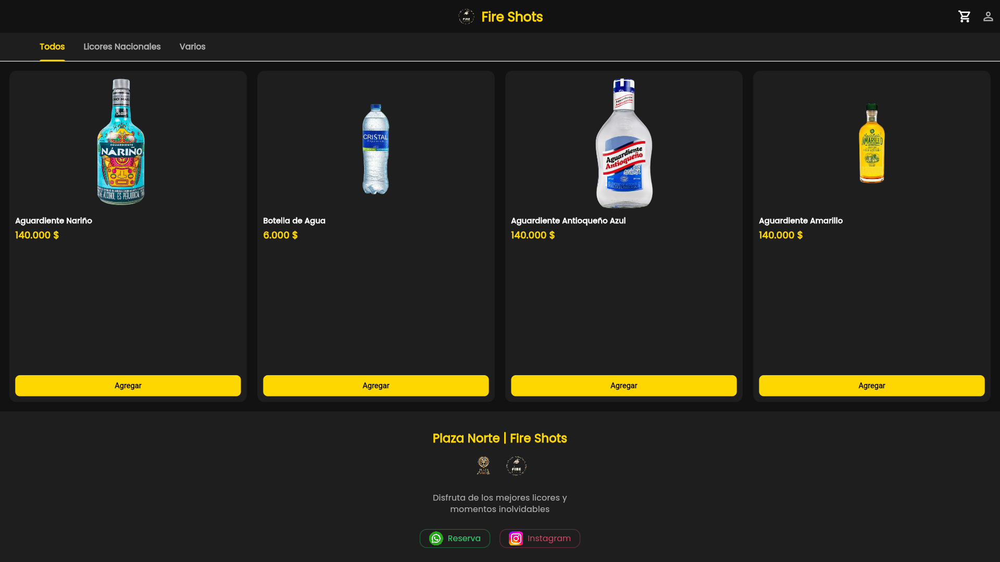
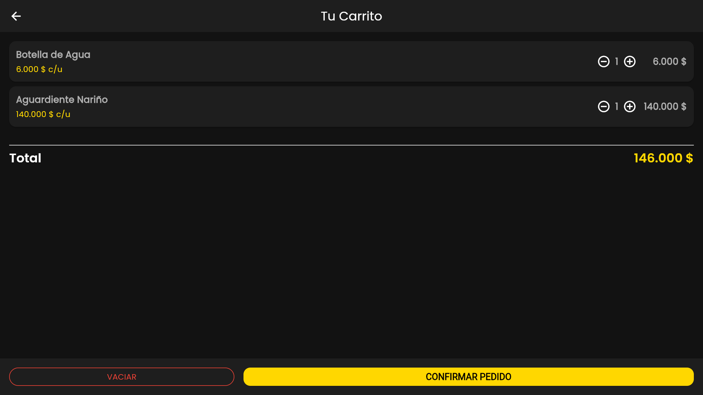
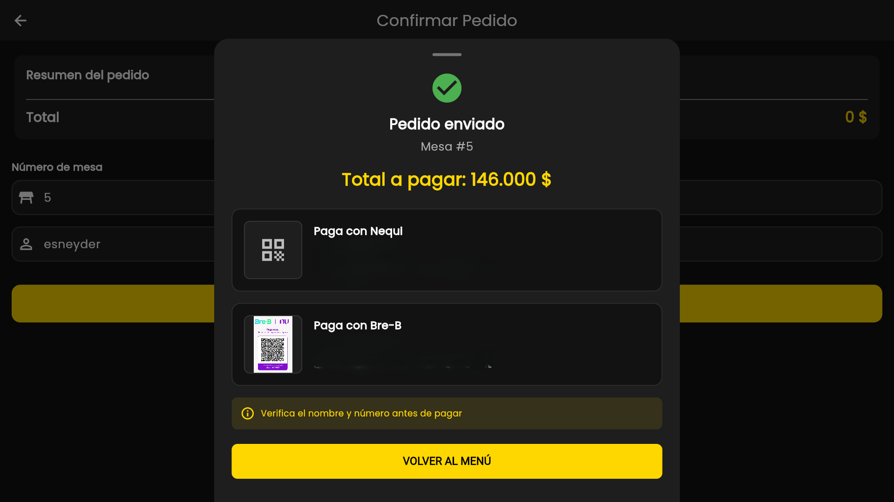
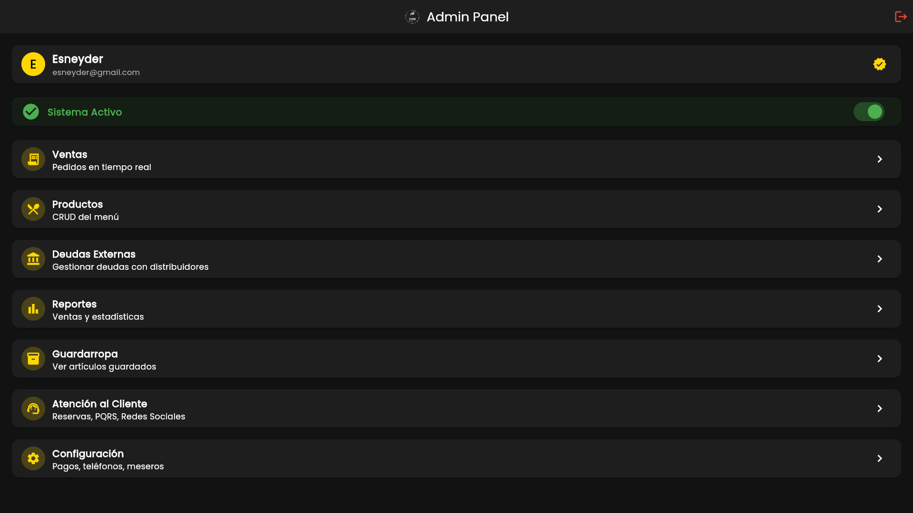
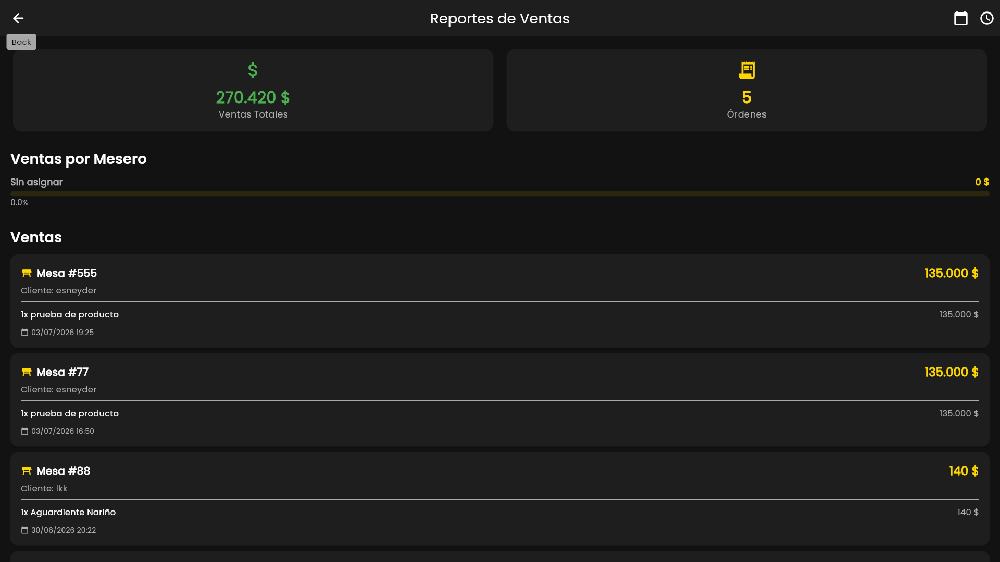

# FireShots POS


<p align="center">
  
</p>

## Descripción

**FireShots POS** es un sistema de punto de venta (POS) diseñado para el bar **Fire Shots**, ubicado en **Plaza Norte, Pasto (Nariño, Colombia)**. Combina una **pantalla de menú digital** pensada para los clientes con un **panel de administración y un KDS (Kitchen Display System)** para el personal.

El cliente puede ver el catálogo de licores, armar su carrito y enviar su pedido indicando el número de mesa; el personal recibe las órdenes **en tiempo real**, las prepara, las entrega y registra el pago respaldado con los datos de Nequi y Bre-B del negocio. El administrador, además, gestiona productos con fotos, controla si el bar está abierto o cerrado, revisa reportes de ventas, registra deudas con distribuidores y administra el guardarropa digital.

## Demo en vivo

La aplicación está desplegada y funcional. Puedes acceder desde:

**https://fireshotspasto.web.app**

> **Nota:** el menú digital es público. Para acceder al panel administrativo o al KDS necesitas credenciales; contacta al administrador para obtener una cuenta de prueba.

## Funcionalidades principales

| Módulo | Descripción |
|--------|-------------|
|  | Catálogo de licores con carrito y pedido por mesa |
|  | Pantalla de cocina para gestionar pedidos en tiempo real |
|  | Gestión de productos, reportes, deudas y configuración |
|  | Pantalla de ventas en tiempo real con el detalle de cada orden |
|  | Tickets numerados con entrega digital |
|  | Registro de deudas con distribuidores |
|  | Reservas por WhatsApp, PQRS e Instagram |

## Capturas de pantalla

Todas las capturas corresponden a la versión web desplegada.

### Menú digital y carrito

<p align="center">
  
  <br>
  
</p>

### Recibo y pago con QR

<p align="center">
  
</p>

### Panel de administración

<p align="center">
  
</p>

### Reportes de ventas

<p align="center">
  
</p>

## Funcionalidades

### Menú digital para clientes
- Catálogo de licores organizado por categorías (nacionales, whisky, vodka, tequila, cervezas, varios).
- Agregar productos al carrito con cantidades y ver el total en pesos colombianos.
- Confirmar el pedido indicando el **número de mesa** y nombre opcional; evita pedidos duplicados en una mesa activa.
- Al enviar el pedido se muestra un recibo con **QR de Nequi y Bre-B** para pagar desde el celular.
- Botón de **reserva por WhatsApp** y enlace a Instagram.
- Control de **sistema abierto o cerrado**: si el bar está apagado, la pantalla informa al cliente que vuelva más tarde.

### KDS y ventas para el personal (requiere iniciar sesión)
- **Bandeja de cocina (KDS):** pedidos pendientes, recibidos y entregados con botones de **RECIBIR**, **ENTREGAR** y **COBRAR**.
- Al cobrar se selecciona el **método de pago** (Efectivo, Nequi, Bancolombia, Transferencia, Bre-B, Otro) y el **mesero** que atendió.
- **Pantalla de ventas en tiempo real:** resúmenes de pedidos activos, nuevas, recibidas y entregadas; las órdenes nuevas **parpadean** en colores llamativos y la pantalla se refresca automáticamente.

### Panel de administración
- **Panel de control:** estadísticas del día (pedidos pendientes, recaudo de hoy, órdenes pagadas) y botón para **abrir o cerrar el sistema** (al cerrar se limpia el guardarropa activo).
- **Productos:** crear, editar, eliminar, activar/desactivar y controlar el stock, con **subida de imagen a Cloudinary**.
- **Ventas:** vista en tiempo real de todos los pedidos.
- **Reportes:** filtros por fecha o últimas 10 horas, **ventas totales, número de órdenes y desempeño por mesero** con barras de porcentaje.
- **Deudas Externas:** registrar deudas con distribuidores (Rey de los Licores, Compra Chepelicores, etc.), marcarlas como pagadas y filtrarlas por estado y fecha.
- **Guardarropa:** registrar artículos con **tickets numerados** (máximo 15), ver el recibo generado y marcarlos como entregados.
- **Atención al Cliente:** reservas por WhatsApp, llamada telefónica, **PQRS** que se envía por correo e Instagram.
- **Configuración:** números y titulares de **Nequi y Bre-B**, teléfonos, URL de Instagram y lista de meseros.

## Tecnologías utilizadas

- **Flutter 3.35** / **Dart 3.9** (aplicación multiplataforma: web, Android, iOS, Windows)
- **Firebase Authentication** (inicio de sesión con correo y contraseña)
- **Cloud Firestore** (base de datos en tiempo real)
- **Firebase Hosting** (publicación web: `fireshotspasto.web.app`)
- **Riverpod** (gestión de estado)
- **Cloudinary** (subida de imágenes de productos)
- **Google Fonts** (tipografía Poppins) y **Material 3** con tema oscuro dorado
- **url_launcher**, **image_picker**, **http** e **intl** (formatos de moneda en COP)

## Estructura del proyecto

```
lib/
├── main.dart                                  → configuración e inicio de Firebase y rutas
├── core/
│   ├── constants/
│   │   ├── app_constants.dart                 → datos y colores del negocio
│   │   ├── firebase_constants.dart            → nombres de colecciones y estados
│   │   └── cloudinary_constants.dart          → credenciales de Cloudinary
│   ├── routes/app_routes.dart                 → rutas de todas las pantallas
│   ├── services/cloudinary_service.dart       → subida de fotos de productos
│   └── theme/app_theme.dart                   → tema oscuro dorado
├── features/
│   ├── auth/                                  → inicio de sesión (admin y staff)
│   ├── menu/                                  → catálogo de productos y carrito
│   ├── cloakroom/                             → guardarropa con tickets
│   ├── orders/                                → pedidos, ventas, deudas y soporte
│   └── admin/                                 → panel de administración
assets/
├── banner.png                                 → portada del README
├── logos/                                     → logos de la app (empaquetado en el build)
├── qr/                                        → códigos QR de Nequi y Bre-B (empaquetado)
└── screenshots/                               → capturas del README (NO se empaqueta)
firebase.json                                  → configuración de Hosting, Firestore y Storage
.firebaserc                                    → proyecto activo de Firebase
firestore.rules / storage.rules                → reglas de seguridad de Firebase
```

## Requisitos previos

- **Flutter** versión 3.35 o superior (incluye Dart 3.9)
- **Git** (para clonar el repositorio)
- **Cuenta de Firebase** y **Firebase CLI** (`npm install -g firebase-tools`)
- **Node.js y npm** (para la CLI de Firebase)

## Configuración y ejecución paso a paso

Sigue estas instrucciones en orden para dejar el proyecto funcionando.

### 1. Copiar el proyecto y acceder a la carpeta

```
git clone https://github.com/printEsneyder/FireShots-POS.git
cd FireShots-POS
```

### 2. Instalar las dependencias de Flutter

```
flutter pub get
```

### 3. Conectar el proyecto a tu cuenta de Firebase

El código inicia Firebase con las credenciales del proyecto `fireshots-pos`. Si vas a usar tu propia cuenta:

1. Crea un proyecto en [console.firebase.google.com](https://console.firebase.google.com).
2. Habilita **Authentication** (correo/contraseña), **Cloud Firestore** y **Hosting**.
3. Instala la CLI de Firebase (`npm install -g firebase-tools`), inicia sesión con `firebase login` y ejecuta:

```
flutterfire configure
```

Esto genera las credenciales que se usan en `lib/main.dart`.

4. Copia las reglas a tu consola de Firebase o publícalas como se indica en el paso 6.

### 4. Crear el usuario administrador

El punto de venta define dos roles por el campo `role` en Firestore (colección **users**):

- `admin`: accede al panel de administración.
- `staff`: accede al KDS y las ventas.

1. Abre Firestore en la consola de Firebase.
2. Crea un documento en la colección `users` cuyo ID sea el **UID** del usuario.
3. Agrega los campos: `displayName` (nombre visible) y `role: "admin"`.

### 5. Ejecutar la aplicación en local

```
flutter run -d chrome
```

También puedes usar `flutter run -d windows` o `flutter run` y elegir la plataforma en el menú. El modo debug abre DevTools en `http://127.0.0.1:9101` con recarga en caliente.

### 6. Compilar y publicar en Firebase Hosting

```
flutter build web --release
firebase deploy --only hosting
```

La aplicación quedará publicada en `https://fireshotspasto.web.app`.

> La carpeta `build/web` es la que se publica. No deben existir archivos ejecutables (`.exe`, `.dll`, `.bat`) dentro de `assets/`, porque el plan **Spark** de Firebase los rechaza y el deploy falla con `Executable files are forbidden on the Spark billing plan`.

Si modificaste las reglas de seguridad, publícalas por separado:

```
firebase deploy --only firestore:rules,firestore:indexes,storage
```

> **Nota:** no olvides desplegar también las reglas de `firestore.rules` y `storage.rules` (Firestore y Storage) para securizar la lectura/escritura de datos.

## Roles y acceso

- **Administrador (`admin`):** panel de control, productos, reportes, deudas, configuración, guardarropa y atención al cliente.
- **Personal (`staff`):** KDS de cocina, ventas en tiempo real, guardarropa, deudas externas y atención al cliente.

Para crear usuarios adicionales: entra con la cuenta admin, crea el usuario en **Firebase Authentication** y asígnale su documento en la colección `users` con el rol correspondiente.

## Uso del panel de administración

1. Abra la aplicación y en la esquina superior toque el ícono de persona e **Inicie sesión**.
2. Ingrese el correo y la contraseña de una cuenta creada en Firebase.
3. Según el rol verá el **panel de administración** o el **KDS de personal**:
   - En **Productos** puede crear un producto con nombre, categoría, precio, stock y fotografía. Al guardar, aparece automáticamente en el menú del cliente.
   - En **Ventas** verá los pedidos en tiempo real y podrá avanzarlos hasta cobrar.
   - En **Reportes** podrá filtrar por día y ver el desempeño por mesero.
   - Use el switch de la pantalla principal para **abrir o cerrar el sistema** al final de la jornada.

## Estado del proyecto

| Aspecto | Estado |
|---------|--------|
| Análisis estático | Sin errores (`flutter analyze`) |
| Compilación web | Exitosa (`flutter build web --release`) |
| Despliegue | Activo en Firebase Hosting |
| Funcionamiento | Completo y listo para demostraciones |

La compilación para Android e iOS no se ha verificado como parte del flujo de publicación; el proyecto incluye las carpetas de plataforma pero el despliegue se hace únicamente para web.

## Preguntas frecuentes

**¿Cómo agrego un producto con foto?**
Desde el panel de administración → **Productos** → botón **+**. Almacere el nombre, seleccione categoría, escriba el precio y el stock, y toque **Subir imagen** para cargarla desde la galería (se guarda en Cloudinary).

**¿Por qué el cliente ve "Sistema cerrado"?**
Porque el administrador apagó el sistema desde el panel. Vuelva a activarlo con el switch **Sistema Activo**.

**¿Cómo creo cuentas para el personal?**
Cree el usuario en Firebase Authentication y luego asigne su UID en la colección `users` de Firestore con `role: "staff"`.

**¿Cómo cambio el número de Nequi o Bre-B que ve el cliente?**
Panel de administración → **Configuración** → edite los números y nombres de los titulares y guarde.

**¿El deploy falla con "Executable files are forbidden"?**
Hay un binario dentro de `assets/`. Bórralo y añade el patrón a `.gitignore` (por ejemplo `*.exe`). Está en `.gitignore` desde la versión actual.

**¿Las reglas de seguridad están aplicadas?**
El repositorio incluye `firestore.rules` y `storage.rules`. Debes publicarlas en la consola de Firebase con `firebase deploy --only firestore:rules,firestore:indexes,storage`; mientras no se desplieguen, la consola aplica las reglas del proyecto, que pueden ser distintas.

Sobre el alcance de las reglas: la lectura de **productos** y **estado del bar** es pública (lo necesita el menú del cliente), y la escritura de **guardarropa**, **deudas externas** y **configuración** exige sesión iniciada. Ten en cuenta que las reglas Current evalúan únicamente que exista sesión, sin comprobar el campo `role`; por lo tanto cualquier cuenta autenticada, incluido el rol `staff`, puede escribir en la configuración del sistema. La colección **orders** tiene lectura pública, necesaria para los refrescos del KDS. Si necesitas restringir por rol o ocultar datos de pedidos a clientes, ajusta las reglas antes de operar.

## Autor

- **Nombre:** Esneyder Ibarra
- **Teléfono:** +57 323 215 7962
- **Correo:** esneydribarra1970@gmail.com
- **LinkedIn:** [esneyder-ibarra-rosero](https://www.linkedin.com/in/esneyder-ibarra-rosero)
- **GitHub:** [printEsneyder](https://github.com/printEsneyder)

---

<p align="center">
  Desarrollado por <a href="https://github.com/printEsneyder">Esneyder Ibarra Rosero</a>
</p>


<p align="center">
  <a href="https://www.linkedin.com/in/esneyder-ibarra-rosero">
    
  </a>
  <a href="mailto:esneydribarra1970@gmail.com">
    
  </a>
</p>
